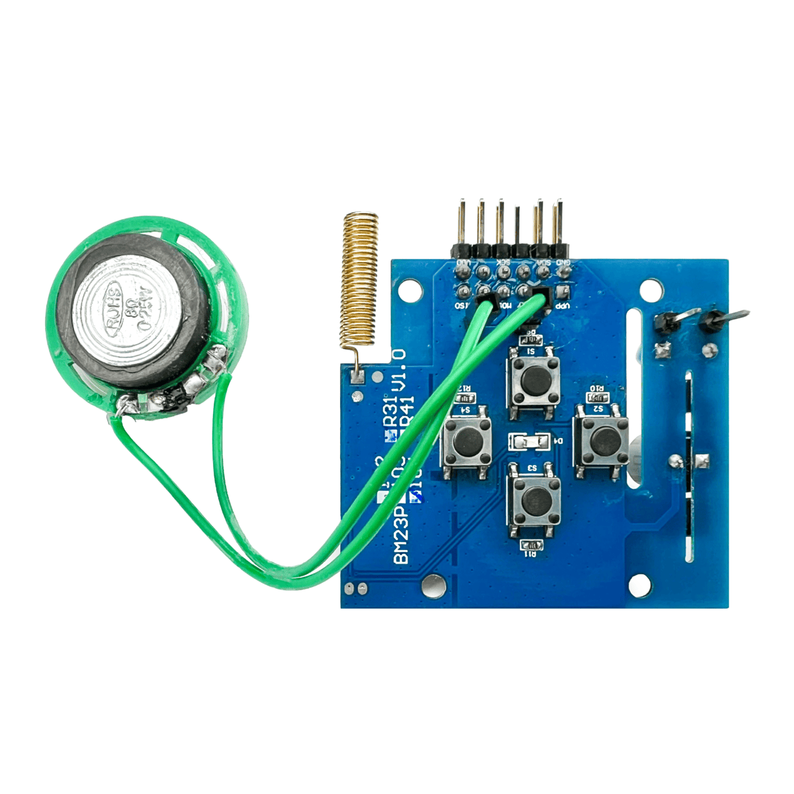
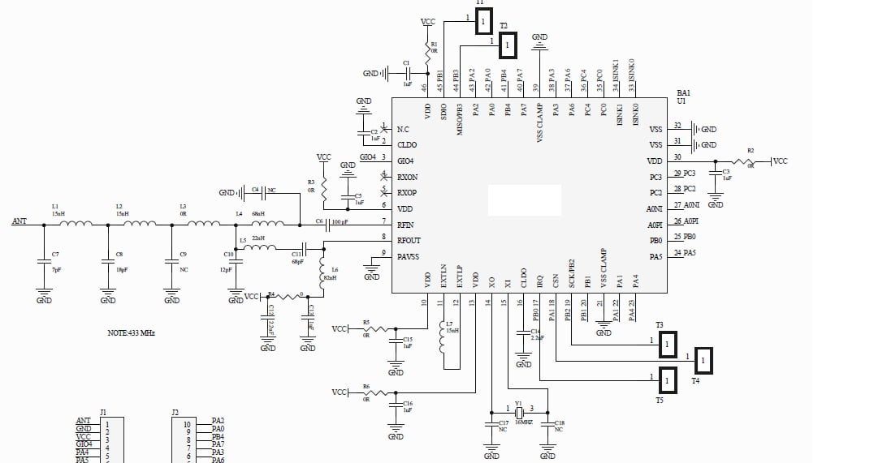
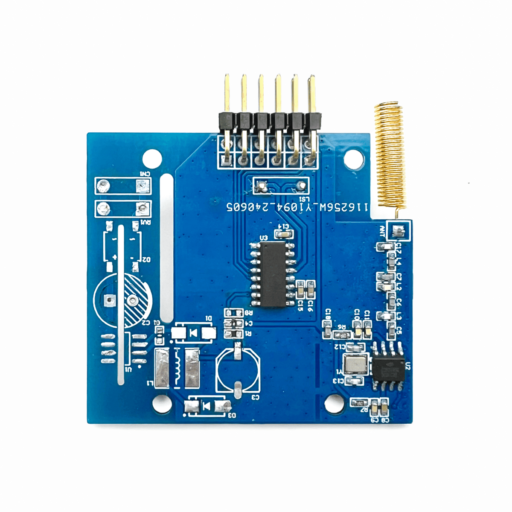
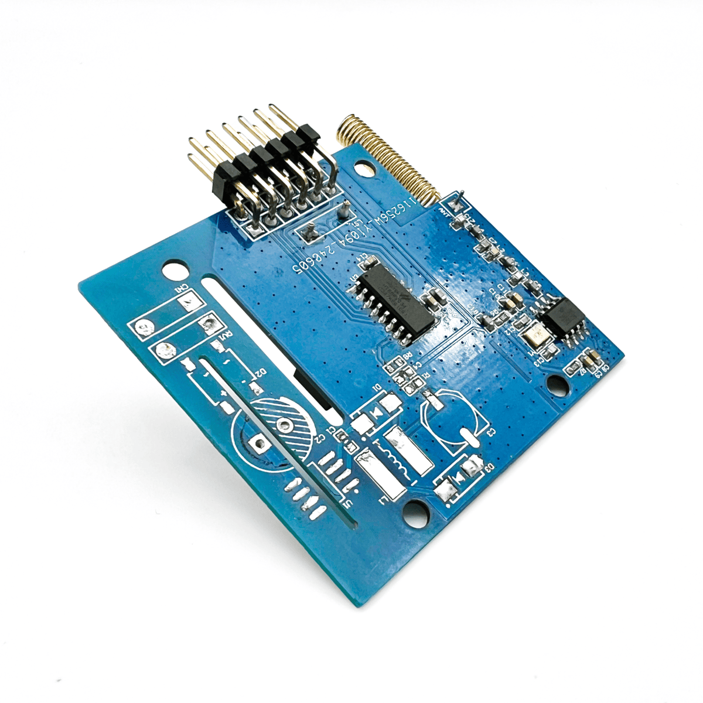

# Wireless Smoke Detector (433MHz Sub-1GHz RF + NB-IoT)

## 📌 Overview
This project implements a **wireless smoke detector system** using a **433MHz Sub-1GHz RF module** and **NB-IoT connectivity**.  
The system supports **star or mesh networking**, enabling multiple smoke detectors to communicate over RF and forward alerts to an NB-IoT gateway for cloud monitoring.  
A dedicated **Holtek HT68RV035 MCU** controls the RF and peripherals, while the **BC2161 RF IC** handles OOK modulation/demodulation at 433MHz.  

---

## ⚙️ System Architecture
[ Smoke Sensor ] ---> [ MCU (Holtek) ] ---> [ RF Module (BC2161, 433MHz) ] ---> [ Gateway / NB-IoT ]
|
v
[ Buttons, LEDs, Speaker (Audio Feedback) ]

- **MCU (Holtek HT68RV035)**  
  - Manages RF communication and peripheral control  
  - Handles button input, LED indication, and audio feedback  
  - Runs firmware in Embedded C for real-time RF signal processing  

- **RF Subsystem (BC2161, 433MHz)**  
  - Sub-1GHz OOK modulation/demodulation  
  - Supports star/mesh network communication  
  - Integrated antenna matching and RF frontend design  

- **User Interface**  
  - 4 programmable push buttons  
  - Status LED (pairing, alert, error)  
  - 8Ω/0.25W speaker for audio alerts and RF pairing feedback  

- **Networking**  
  - Local RF communication: 433MHz Sub-1GHz  
  - Cloud uplink: NB-IoT gateway  
  - Topology: Star or mesh, configurable  

---

## 🖥 Image Descriptions

### 1. RF Control Board – Top View
  
- Main PCB with Holtek MCU and BC2161 RF IC.  
- Exposed header pins for programming/debugging.  
- Integrated 433MHz coil antenna.  

---

### 2. RF Schematic (433MHz Frontend + MCU)
  
- RF front-end network for 433MHz band with LC matching.  
- Holtek HT68RV035 MCU managing digital I/O, RF interface, and control signals.  
- Speaker and LED connected to MCU GPIO with PWM audio support.  

---

### 3. Control Board with Buttons & Speaker
  
- 4 programmable push buttons for control and pairing.  
- Small 8Ω/0.25W speaker for alerts.  
- On-board spring antenna for RF communication.  

---

### 4. RF Module (Assembled PCB, back view)
  
- Back side of RF PCB showing RF IC, MCU, and passives.  
- Optimized ground plane for RF stability.  
- Compact form factor for integration inside smoke detector housing.  

---

## 🔧 Hardware Details
- **MCU**: Holtek HT68RV035  
- **RF IC**: BC2161 (433MHz OOK modulation/demodulation)  
- **Peripherals**:  
  - 4x push buttons (user input / pairing)  
  - 1x LED indicator  
  - 1x 8Ω / 0.25W speaker (PWM driven)  
- **RF Network**: LC-matching network, spring antenna, 433MHz tuned  
- **Power Supply**: 3.3V LDO from battery pack  

---

## 🛡 Safety Features
- Real-time smoke alert via RF + NB-IoT  
- Audio + LED indication for local alerts  
- Fail-safe RF re-pairing via button input  
- Watchdog timer on MCU for reliability  
- Mesh redundancy (alerts forwarded via neighbors if direct link fails)  

---

## 🚀 Future Improvements
- Add AES encryption for RF payloads  
- Implement low-power modes for extended battery life  
- Support FSK modulation for higher noise immunity  
- Add cloud integration for historical logging & remote alerts  

---

## 📑 Notes
This document is a **summary of the project**.  
Due to **customer confidentiality agreements**, detailed schematics, PCB layouts, and firmware code **cannot be shared publicly**.  
